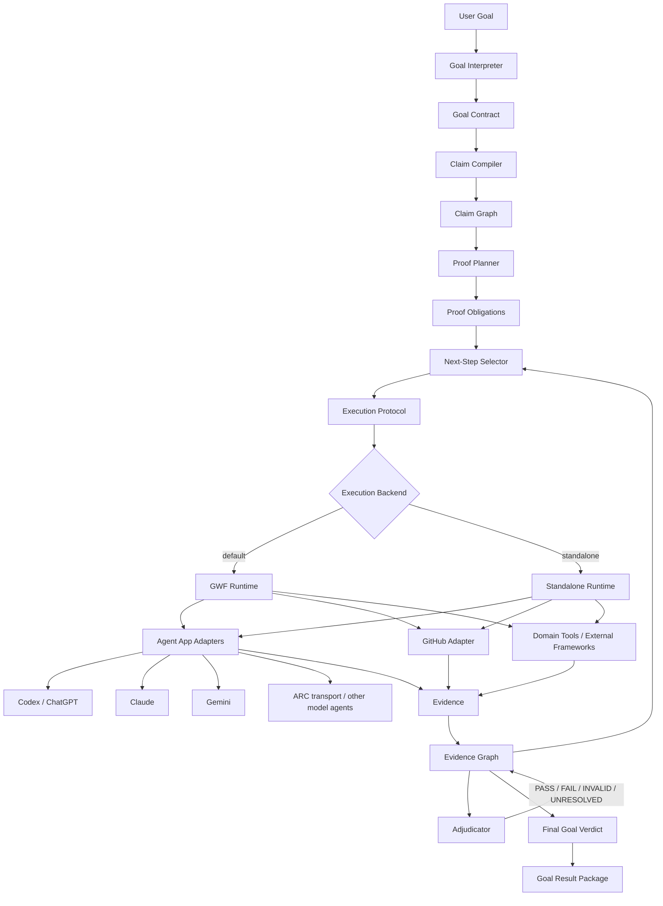

# G2E Framework — Goal-to-Evidence

**Status:** specification baseline  
**Repository:** GWF  
**Branch:** `feature/g2e-framework`  
**Execution default:** GWF  
**Standalone mode:** required  
**Primary agent-app adapters:** Codex / ChatGPT first; Claude and Gemini next; ARC transport for other model-backed agents.

G2E turns a user goal into a governed sequence of claims, proof obligations, executions, evidence, adjudications, and next-step decisions until the goal is either sufficiently supported, falsified, invalidated, unresolved, or explicitly stopped.

G2E is **not** a training framework, benchmark suite, workflow UI, or agent model. It is the reasoning-and-proof layer that answers:

> Given only a goal, what must be true before we are allowed to claim the goal is achieved, what is the next admissible proof, what evidence is sufficient, and what conclusions remain valid after execution?

The framework is extracted from the working method used to qualify the MindForge model pipeline: prerequisites before downstream claims, fixture-scale falsification before expensive runs, frozen decision rules before outcomes, exact evidence identity, technical INVALID distinct from scientific FAIL, no silent rescue, and “what remains unproven?” after every result.

## 1. Architecture



## 2. Core principle

**Agents propose; G2E validates and freezes; execution produces evidence; adjudication decides.**

ChatGPT, Codex, Claude, Gemini, or any other agent must never be the authoritative record of:

- what was frozen;
- which claim was under test;
- which resources were fresh/protected;
- what threshold applied;
- whether a run was terminal;
- whether a FAIL may be retried;
- which evidence supports a final claim.

Those facts belong to G2E state and, when GWF is used, to governed GWF state.

## 3. Main loop

```text
USER GOAL
   ↓
Goal Contract
   ↓
Claim Graph
   ↓
Proof Obligations
   ↓
select next admissible proof
   ↓
freeze execution contract
   ↓
execute via GWF by default
   ↓
collect attributable evidence
   ↓
PASS / FAIL / INVALID / UNRESOLVED
   ↓
update evidence graph
   ↓
ask: "what remains unproven?"
   ↓
repeat until goal terminal
   ↓
Goal Result Package
```

The framework must **not** hard-code MindForge phases such as M0/M1/M2. Those phases are reference evidence from which generic meta-rules are extracted.

## 4. G2E versus GWF

| Concern | G2E | GWF |
| --- | --- | --- |
| Interpret user goal | Owns | Does not own |
| Derive falsifiable claims | Owns | Does not own |
| Construct proof obligations | Owns | Does not own |
| Determine admissible next proof | Owns | Executes selected work |
| Persist governed execution state | Minimal standalone implementation | **Default authoritative runtime** |
| Authority / approval | Policy interface | **Default implementation** |
| Recovery / handoff | Declares semantics | **Default implementation** |
| GitHub SHA-safe writes | Adapter contract | **Default implementation** |
| Agent app execution | Adapter abstraction | GWF interop layer by default |
| Scientific/technical adjudication | Owns | Persists/enforces when integrated |
| Final goal closure | Owns | Provides governed evidence/history |

G2E must remain runnable without GWF, but standalone mode may not silently weaken mandatory proof invariants.

## 5. Agent-app strategy

G2E consumes the GWF Agent Interoperability model rather than inventing a competing agent runtime.

Priority:

1. **Codex / ChatGPT app harnesses** — primary development target.
2. **Claude adapter** — same normalized binding/execution envelope.
3. **Gemini adapter** — same normalized binding/execution envelope.
4. **ARC transport** — transport option for other model-backed agents. ARC is not treated as a resource class or model identity.

Provider identity, transport identity, harness identity, capabilities, constraints, and attempt identity must remain separate.

## 6. Framework components

| Component | PRD |
| --- | --- |
| Goal Contract | [PRD-01](docs/PRD_01_GOAL_CONTRACT.md) |
| Claim Compiler & Claim Graph | [PRD-02](docs/PRD_02_CLAIM_GRAPH.md) |
| Proof Obligation Planner | [PRD-03](docs/PRD_03_PROOF_PLANNER.md) |
| Evidence Graph | [PRD-04](docs/PRD_04_EVIDENCE_GRAPH.md) |
| Adjudicator | [PRD-05](docs/PRD_05_ADJUDICATOR.md) |
| Next-Step Selector | [PRD-06](docs/PRD_06_NEXT_STEP_SELECTOR.md) |
| Execution Protocol | [PRD-07](docs/PRD_07_EXECUTION_PROTOCOL.md) |
| GWF Adapter | [PRD-08](docs/PRD_08_GWF_ADAPTER.md) |
| Agent App Adapters | [PRD-09](docs/PRD_09_AGENT_APP_ADAPTERS.md) |
| GitHub Adapter | [PRD-10](docs/PRD_10_GITHUB_ADAPTER.md) |
| Standalone Runtime | [PRD-11](docs/PRD_11_STANDALONE_RUNTIME.md) |
| Goal Result Package | [PRD-12](docs/PRD_12_RESULT_PACKAGE.md) |
| Reference Acquisition | [PRD-13](docs/PRD_13_REFERENCE_ACQUISITION.md) |
| Security & Authority | [PRD-14](docs/PRD_14_SECURITY_AUTHORITY.md) |

See the full document map in [PRD_INDEX.md](docs/PRD_INDEX.md).

## 7. Governing meta-rules

The initial rule set extracted from real qualification work is:

1. Do not test a downstream claim until its hard prerequisites are supported.
2. Use the smallest fixture capable of falsifying the mechanism before consuming expensive or fresh resources.
3. Distinguish technical `INVALID` from substantive `FAIL`.
4. Freeze decision rules before outcome exposure.
5. A PASS authorizes only claims whose dependencies are satisfied; it does not prove the final goal.
6. A FAIL remains part of lineage and cannot be silently rescued by threshold, seed, data, or semantic mutation.
7. Reuse mature external implementations when available; integrate + qualify instead of rebuilding.
8. Agent output is a proposal until validated and frozen by the framework.
9. Evidence must be attributable to exact source, execution, resource, and artifact identities.
10. After every adjudication, recompute “what remains unproven?” from the claim/evidence graph.
11. Fresh/protected resources may be consumed only by prospectively authorized proof obligations.
12. A change to a scientific or normative claim after outcome exposure creates a new lineage unless the frozen amendment policy explicitly allows it.

## 8. Lineage

G2E project-level results are recorded in the append-only [LINEAGE.md](LINEAGE.md).

The lineage is intentionally short. It records only completed phase outcomes and authoritative identities. Development mistakes, transient test failures, and implementation debugging belong in normal Git history/CI evidence, not in project scientific lineage.

## 9. Reference implementation source

The first empirical source for G2E methodology is the MindForge model-pipeline qualification lineage through M4:

- [MindForge M0–M4 evidence tree](https://github.com/minhtri22/MindForge/tree/62141d530832f7694342fe92704a5975bfdbbded/artifacts/model-training-pipeline)
- [M3 governance result](https://github.com/minhtri22/MindForge/blob/62141d530832f7694342fe92704a5975bfdbbded/artifacts/model-training-pipeline/m3/IMPLEMENTATION_RESULT.md)
- [M4 reasoning result](https://github.com/minhtri22/MindForge/blob/62141d530832f7694342fe92704a5975bfdbbded/artifacts/model-training-pipeline/m4/IMPLEMENTATION_RESULT.md)

These are **reference evidence**, not a fixed G2E workflow.

## 10. GWF references

- [GWF README](../README.md)
- [Agent Interoperability Foundation](../docs/V0.8.7_AGENT_INTEROPERABILITY_FOUNDATION.md)
- [Reference Acquisition Specification](../docs/V0.8.6_REFERENCE_ACQUISITION_SPEC.md)
- [Documentation Integrity & Governance](../docs/DOCUMENTATION_INTEGRITY_GOVERNANCE_SPEC.md)
- [7-Wave GWF implementation plan](../docs/IMPLEMENTATION_7_WAVES_PLAN.md)
- [Research domain](../domains/research.workflow.yaml)

## 11. Current authorization frontier

This branch currently authorizes **specification and architecture only**. No G2E runtime implementation, agent execution, GWF schema change, or migration is implied merely by the presence of these PRDs.
