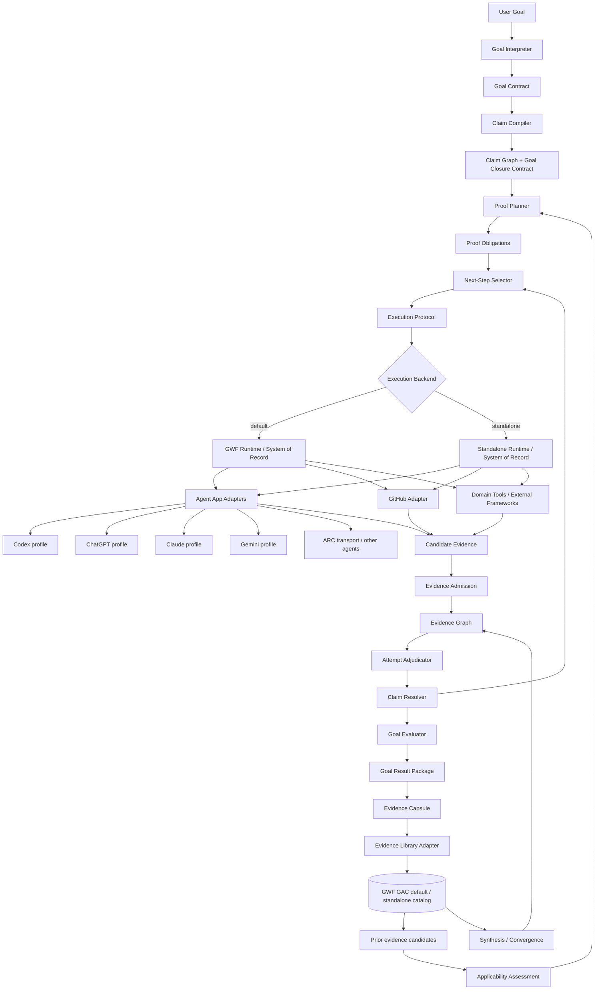

# G2E Framework — Goal-to-Evidence

**Status:** specification baseline / semantic QA hardening  
**Repository:** GWF  
**Branch:** `feature/g2e-framework`  
**Execution default:** GWF  
**Standalone mode:** required  
**Primary agent-app priority:** Codex and ChatGPT first as separate app profiles; Claude and Gemini next; ARC transport for other model-backed agents.

G2E turns a user goal into a governed sequence of claims, proof obligations, executions, evidence, adjudications, claim resolutions, and next-step decisions until the goal is ACHIEVED, FALSIFIED, UNRESOLVED, or explicitly STOPPED.

G2E is **not** a training framework, benchmark suite, workflow UI, or agent model. It is the proof-reasoning layer that answers:

> Given only a goal, what must be true before we may claim the goal is achieved, what is the next admissible proof, what evidence is sufficient, and what conclusions remain valid after execution?

The framework is extracted from working qualification practice, including MindForge M0–M4: prerequisites before downstream claims, fixture-scale falsification before expensive runs, frozen decision rules before outcomes, exact evidence identity, technical INVALID distinct from substantive FAIL, no silent rescue, and “what remains unproven?” after every result.

## 1. Architecture



## 2. Normative semantics and source of truth

Shared state, verdict, lock, freshness, evidence-admission, authority, selection, and integrity semantics are normative in [CORE_SEMANTICS.md](docs/CORE_SEMANTICS.md).

The exact design baselines are pinned in [REFERENCE_BASELINE.md](docs/REFERENCE_BASELINE.md).

**Semantic authority:** G2E defines what Goal/Claim/Proof/Evidence/Adjudication objects and verdicts mean.

**Persistence/system-of-record authority:** the active runtime stores the canonical G2E objects.

- In default mode, GWF is the durable system of record and governance runtime.
- In standalone mode, the standalone runtime stores the same canonical G2E IDs/hashes.
- Runtime adapters may add runtime-specific IDs but may not reinterpret G2E semantics.

This avoids competing sources of truth.

## 3. Core principle

**Agents propose; authorized G2E contracts freeze semantics; execution produces candidate evidence; evidence admission controls use; adjudication decides attempts; frozen resolution policies decide claims/goals.**

No agent app is authoritative for:

- frozen semantic identity;
- fresh/protected-resource state;
- thresholds/baselines;
- admitted evidence;
- terminal adjudication;
- Claim resolution;
- Goal verdict.

## 4. Main loop

```text
USER GOAL
   ↓
freeze GoalContract requirements
   ↓
compile/review ClaimGraph
   ↓
freeze GoalClosureContract
   ↓
plan + freeze ProofObligation
   ↓
deterministic admissibility
   ↓
governed Next-Step selection
   ↓
execute via GWF by default
   ↓
admit attributable evidence
   ↓
attempt verdict:
PASS / FAIL / INVALID / UNRESOLVED
   ↓
resolve Proof/Claim under frozen policies
   ↓
evaluate GoalClosureContract
   ↓
ask "what remains unproven?"
   ↓
repeat while GoalVerdict = IN_PROGRESS
   ↓
Goal Result Package
```

The framework must **not** hard-code MindForge phases such as M0/M1/M2. Those phases are reference evidence from which generic meta-rules are extracted.

## 5. G2E versus GWF

| Concern | G2E | GWF default runtime |
| --- | --- | --- |
| Interpret user goal | Owns semantic contract | Persists governed revision |
| Derive falsifiable claims | Owns | Persists/authorizes |
| Construct proof obligations | Owns | Persists/authorizes execution |
| Determine admissible next proof | Owns policy | Enforces governed execution |
| Persist authoritative state | Canonical schema/identity | **Default system of record** |
| Authority / approval | Declares required actions/policies | **Default implementation** |
| Recovery / handoff | Declares semantic invariants | **Default implementation** |
| GitHub SHA-safe writes | Adapter contract | Existing/default implementation path |
| Agent app execution | Adapter abstraction | GWF interop layer by default |
| Adjudication semantics | Owns | Persists/enforces record |
| Final goal closure | Owns | Persists governed result/history |

G2E remains runnable without GWF, but standalone mode may not silently weaken mandatory proof invariants.

## 6. Agent-app strategy

Priority wave:

1. **Codex app profile** and **ChatGPT app profile** — same priority, separately resolved capabilities/harness identities; no assumed parity.
2. **Claude adapter profile**.
3. **Gemini adapter profile**.
4. **ARC transport paths** for other model-backed agents.

Provider identity, model identity, agent-app identity, transport identity, harness identity, capabilities, constraints, and attempt identity remain separate.

## 7. Framework documents

- [Core Semantics](docs/CORE_SEMANTICS.md)
- [Reference Baseline](docs/REFERENCE_BASELINE.md)
- [PRD Index](docs/PRD_INDEX.md)
- [Architecture Decisions](docs/ARCHITECTURE_DECISIONS.md)
- [Phase Plan](docs/PHASE_PLAN.md)
- [Current Semantic QA](docs/QA_doc.md)
- [Append-only Lineage](LINEAGE.md)

Component PRDs:

| Component | PRD |
| --- | --- |
| Goal Contract | [PRD-01](docs/PRD_01_GOAL_CONTRACT.md) |
| Claim Compiler & Claim Graph | [PRD-02](docs/PRD_02_CLAIM_GRAPH.md) |
| Proof Obligation Planner | [PRD-03](docs/PRD_03_PROOF_PLANNER.md) |
| Evidence Graph | [PRD-04](docs/PRD_04_EVIDENCE_GRAPH.md) |
| Adjudicator | [PRD-05](docs/PRD_05_ADJUDICATOR.md) |
| Next-Step Selector | [PRD-06](docs/PRD_06_NEXT_STEP_SELECTOR.md) |
| Execution Protocol | [PRD-07](docs/PRD_07_EXECUTION_PROTOCOL.md) |
| GWF Adapter | [PRD-08](docs/PRD_08_GWF_ADAPTER.md) |
| Agent App Adapters | [PRD-09](docs/PRD_09_AGENT_APP_ADAPTERS.md) |
| GitHub Adapter | [PRD-10](docs/PRD_10_GITHUB_ADAPTER.md) |
| Standalone Runtime | [PRD-11](docs/PRD_11_STANDALONE_RUNTIME.md) |
| Goal Result Package | [PRD-12](docs/PRD_12_RESULT_PACKAGE.md) |
| Reference Acquisition | [PRD-13](docs/PRD_13_REFERENCE_ACQUISITION.md) |
| Security & Authority | [PRD-14](docs/PRD_14_SECURITY_AUTHORITY.md) |
| Evidence Reuse & Applicability | [PRD-15](docs/PRD_15_EVIDENCE_REUSE_APPLICABILITY.md) |
| Synthesis & Convergence | [PRD-16](docs/PRD_16_SYNTHESIS_CONVERGENCE.md) |
| Evidence Library Adapter | [PRD-17](docs/PRD_17_EVIDENCE_LIBRARY_ADAPTER.md) |

## 8. Governing meta-rules

1. Do not test a downstream claim until HARD prerequisites are supported.
2. Use the smallest **admissible under frozen SelectionPolicy** fixture before expensive/fresh resources.
3. Distinguish executor state, Adjudication verdict, Claim resolution, and Goal verdict.
4. Freeze decision rules before OUTCOME_EXPOSED.
5. PASS authorizes only dependent semantics defined by frozen resolution/closure contracts.
6. FAIL remains in lineage and cannot be rescued by post-outcome semantic mutation.
7. Integrate + qualify mature external implementations before rebuilding them.
8. Agent output is proposal until validated/frozen/admitted.
9. Evidence must bind exact producer/source/resource/artifact identities.
10. After every adjudication, recompute “what remains unproven?” from the governed graph.
11. Fresh/protected resources require prospective authorization and durable exposure tracking.
12. Normative post-outcome changes create new affected lineage; old verdicts remain immutable.
13. Prior library results are EXPOSED knowledge; reuse never recreates freshness.
14. Prior results never directly set a current Claim PASS; qualified reuse is a governed ProofObligation.
15. Cross-study synthesis freezes universe/inclusion/independence/aggregation rules before formal outcome selection.
16. Shared provenance is clustered before treating multiple results as independent confirmation.

## 9. Lineage

Project-level completed phase outcomes are recorded in append-only [LINEAGE.md](LINEAGE.md). Development mistakes, transient test failures, and implementation debugging remain in Git/CI evidence, not scientific/project lineage.

## 10. Reference implementation source

MindForge M0–M4 is empirical method evidence, not a G2E phase template. Exact identities are pinned in [REFERENCE_BASELINE.md](docs/REFERENCE_BASELINE.md).

## 11. Current authorization frontier

Implementation authorization is controlled by [QA_doc.md](docs/QA_doc.md) and [PHASE_PLAN.md](docs/PHASE_PLAN.md).

P0.2 — Evidence Reuse & Convergence Specification is now part of the pre-P1 foundation. P1 MUST NOT start until [P0.2 QA](docs/P0_2_LIBRARY_SYNTHESIS_QA.md) is PASS with no open findings.
